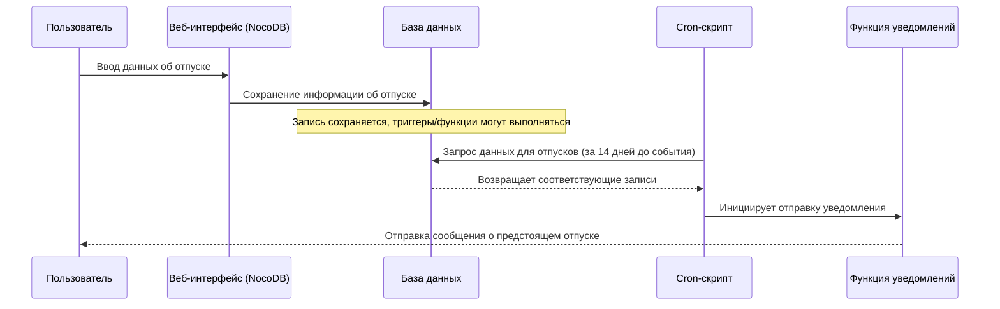

___
Теги: #task 
Дата создания: 2025-02-17 17:28 
Последнее изменение: понедельник 17-го февраля 2025 17:28:45
<< [[2025-02-16]] | [[2025-02-18]] >> 
___
## Перечень основных БП в NocoDB

### Общее

### YSTS-TEAM

1. Создание и модифицирование сотрудника
2. Внесение информации о повышениях
3. Внесение информации о перемещениях
4. Внесение информации об отпусках
### YSTS-CERT

1. Внесение информации о сертификатах сотрудников
2. Ведение информации о доступных курсах и сертификатах
3. Ведение расписания с активными внешними курсами сотрудников

### YSTS-INVENT

1. Ведение информации об инвентаризации оборудования
2. 

### YSTS-FINANCE

### YCATALOG

  

  

___
### Zero-Links
- [[00 YSTS]]
- [[01 NocoDB]]

### Links
- 
