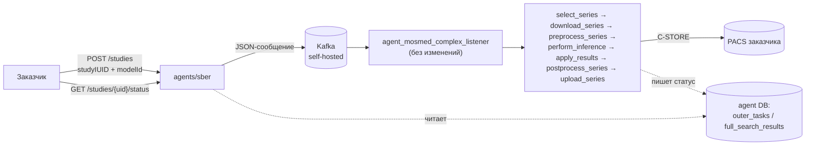

___
Теги: #task 
Дата создания: 2026-02-28 11:02 
Последнее изменение: среда 2-го сентября 2026 14:43:00
<< [[2026-09-01]] | [[2026-09-03]] >> 
___
## Основное

### Как устроен пайплайн

Заказчик отправляет HTTP-запрос в API-сервис — новый лёгкий сервис, который сам ничего не обрабатывает, а просто транслирует запрос в JSON-сообщение и кладёт его в наш собственный (self-hosted) Kafka. Дальше в дело вступает уже существующий, ни разу не изменённый пайплайн (`agent_mosmed_complex_listener` → Celery) — тот же самый, что несколько лет обрабатывает исследования для Мосмеда:

`select_series` (выбор нужной серии) → `download_series` (C-MOVE, скачивание из PACS) → `preprocess_series` → `perform_inference` (сами AI-модели) → `apply_results` → `postprocess_series` (отрисовка результата) → `upload_series` (C-STORE, выгрузка результата обратно в PACS).

Статус узнаём отдельным запросом `GET /status`, потому что обработка асинхронная и занимает минуты.

### Схема



### Что обязательно нужно присылать

`POST /studies` — обязательны только два поля:

| Поле | Тип | Описание |
|---|---|---|
| `studyIUID` | string | StudyInstanceUID исследования в PACS |
| `modelId` | int | Код модели (напр. `1167` = комплексный CT: кровоизлияние + ишемия + измерения) |

Всё остальное (модальность, дата исследования, анатомическая область, возрастная группа, регион) сервис доопределяет сам — по `modelId` и дефолтам. Если что-то из этого реально известно заказчику — можно передать явно, это переопределит дефолт:

```json
{
  "studyIUID": "1.2.3.4.5",
  "modelId": 1167,
  "studyDate": "2026-09-02T10:00:00Z",
  "researchParams": {
    "modalityTypeCode": "CT",
    "anatomicalAreasCode": ["HEAD"],
    "ageGroup": "ADULT"
  }
}
```

### Что возвращает сервис

**`POST /studies`** → `202 Accepted` — подтверждение приёма, не готовности результата:
```json
{"study_instance_uid": "1.2.3.4.5", "accepted": true}
```

**`GET /studies/{uid}/status?model_id=...`** → текущий статус:

| `status` | Значение |
|---|---|
| `null` (`found: false`) | исследование вообще не отправлялось |
| `PROCESSING` | принято, обрабатывается |
| `SUCCESS` | обработано, результат выгружен в PACS |
| `FAILED` | упало — `error_code`/`error_description` содержат реальную причину от пайплайна |

Пример успеха:
```json
{"study_instance_uid": "...", "model_id": 1167, "found": true, "status": "SUCCESS", "ml_version": "0.1.0", "missing": null, "error_code": null, "error_description": null, "created_at": "2026-09-02T10:16:14Z"}
```

Пример ошибки:
```json
{"study_instance_uid": "...", "model_id": 1167, "found": true, "status": "FAILED", "error_code": "Series error", "error_description": "Нет подходящих для обработки серий в исследовании..."}
```

___
## Тестовый блок

4 подготовленных исследования — запуск + проверка статуса каждой парой команд.

> [!note] Уже проверено раньше в этой сессии
> Тест 1 — известный **успешный** прогон (дошёл до `SUCCESS`).
> Тест 4 — известный **падающий** прогон (`FAILED`, `Series error` — неподдерживаемый `ConvolutionKernel`), хороший кандидат показать честную обработку ошибки.
> Тесты 2 и 3 — не проверялись мной, стоит прогнать заранее перед демонстрацией.

### Тест 1 ✅ известный успех

```bash
curl -X POST http://10.0.250.34:6001/studies \
  -H "X-Api-Key: qYpCCiDSG_DqUcU6miQumXdsBJGe9AcGEG-B1JKXA9A" \
  -H "Content-Type: application/json" \
  -d '{"studyIUID": "1.2.40.0.13.1.119265467617234435164942653807321276474", "modelId": 1167}'

curl "http://10.0.250.34:6001/studies/1.2.40.0.13.1.119265467617234435164942653807321276474/status?model_id=1167" \
  -H "X-Api-Key: qYpCCiDSG_DqUcU6miQumXdsBJGe9AcGEG-B1JKXA9A"
```

### Тест 2

```bash
curl -X POST http://10.0.250.34:6001/studies \
  -H "X-Api-Key: qYpCCiDSG_DqUcU6miQumXdsBJGe9AcGEG-B1JKXA9A" \
  -H "Content-Type: application/json" \
  -d '{"studyIUID": "1.2.40.0.13.1.25395597706533050314686192489618241365", "modelId": 1167}'

curl "http://10.0.250.34:6001/studies/1.2.40.0.13.1.25395597706533050314686192489618241365/status?model_id=1167" \
  -H "X-Api-Key: qYpCCiDSG_DqUcU6miQumXdsBJGe9AcGEG-B1JKXA9A"
```

### Тест 3

```bash
curl -X POST http://10.0.250.34:6001/studies \
  -H "X-Api-Key: qYpCCiDSG_DqUcU6miQumXdsBJGe9AcGEG-B1JKXA9A" \
  -H "Content-Type: application/json" \
  -d '{"studyIUID": "1.2.840.113619.2.55.3.2831173476.421.1700807972.257", "modelId": 1167}'

curl "http://10.0.250.34:6001/studies/1.2.840.113619.2.55.3.2831173476.421.1700807972.257/status?model_id=1167" \
  -H "X-Api-Key: qYpCCiDSG_DqUcU6miQumXdsBJGe9AcGEG-B1JKXA9A"
```

### Тест 4 ⚠️ известный fail (демо честной ошибки)

```bash
curl -X POST http://10.0.250.34:6001/studies \
  -H "X-Api-Key: qYpCCiDSG_DqUcU6miQumXdsBJGe9AcGEG-B1JKXA9A" \
  -H "Content-Type: application/json" \
  -d '{"studyIUID": "1.2.40.0.13.1.107647473269313309077894973948730474389", "modelId": 1167}'

curl "http://10.0.250.34:6001/studies/1.2.40.0.13.1.107647473269313309077894973948730474389/status?model_id=1167" \
  -H "X-Api-Key: qYpCCiDSG_DqUcU6miQumXdsBJGe9AcGEG-B1JKXA9A"
```

___
### Zero-Links
- 

### Links
- [[mosmed-complex]]
