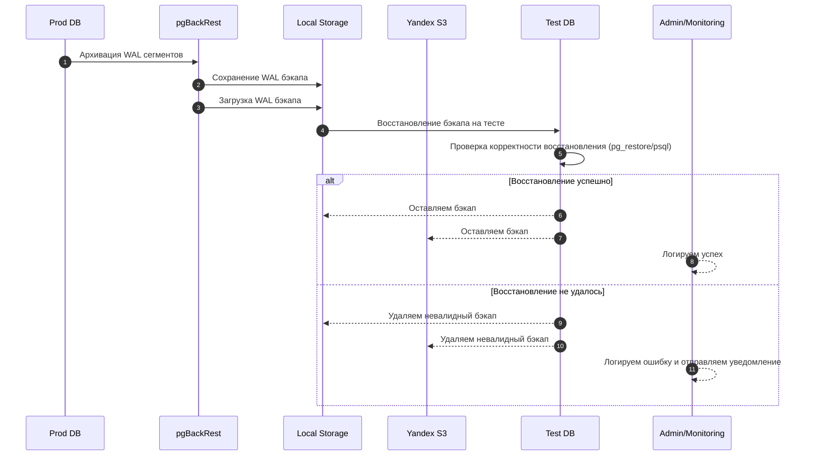
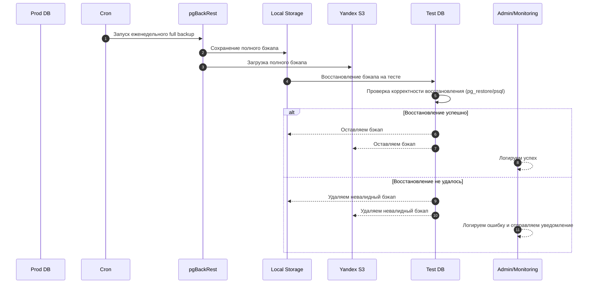
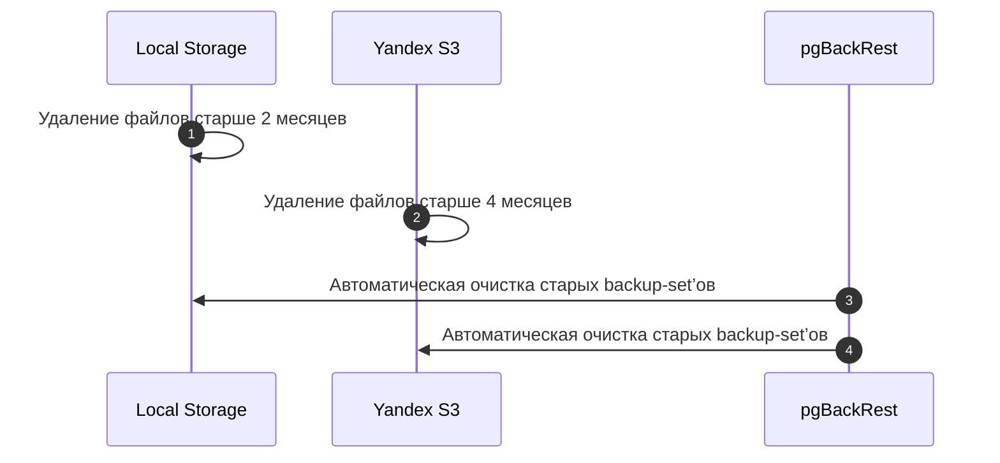

___
Теги: #task #knwoledge 
Дата создания: 2025-09-18 07:40 
Последнее изменение: четверг 18-го сентября 2025 07:40:08
<< [[2025-09-17]] | [[2025-09-19]] >> 
___
## Общий план резервного копирования PostgreSQL  с применением pgBackRest

### 1. Архитектура и компоненты

- **Продуктивная база (Prod DB)** – основной источник данных.
- **Тестовая база (Test DB)** – для проверки корректности бэкапов.
- **Внутренне хранилище бэкапов (Cephs)** – внутренний S3, для хранения локальных копий БД.
- **Yandex Object Storage** – облачное хранение бэкапов.
- **Мониторинг и алёрты** – Prometheus + Grafana + Telegram notifications.
- **pgBackRest** – инструмент для создания full, differential и incremental бэкапов, PITR.

---
### 2. Типы бэкапов

| Тип                   | Частота                   | Хранение                                                            |
| --------------------- | ------------------------- | ------------------------------------------------------------------- |
| WAL (инкрементальный) | Ежедневно                 | Локальный backup server + S3 (4 месяца в облаке, 2 месяца локально) |
| Full backup           | Еженедельно               | Локально + S3                                                       |
| Проверка бэкапа       | Еженедельно/по завершению | Тестовая база                                                       |

---
### 3. Общий Workflow создания бэкапа

1. **Ежедневный WAL backup**
    - pgBackRest автоматически архивирует *WAL* сегменты.
    - WAL сегменты выгружаются *локально* и в *Yandex Object Storage*.
    - Автоматически разворачиваем бэкап на *Test DB*.
    - Проверяем корректность восстановления (pg_restore или psql).
    - В случае ошибки: *логируем* + *уведомляем* админа и *удаляем* невалидный бэкап.
	    - ***(успешные будем делать каждый день?)***.
2. **Еженедельный full backup**
    - *Cron* запускает pgBackRest на *Prod DB*.
    - Full backup сохраняется *локально* и выгружается в *Yandex Object Storage*.
    - Автоматически разворачиваем бэкап на *Test DB*.
    - Проверяем корректность восстановления (pg_restore или psql).
    - В случае ошибки: *логируем* + *уведомляем* админа и *удаляем* невалидный бэкап.
3. **Retention & Cleanup**
    - Локально: удаляем файлы старше 2 месяцев.
    - S3: удаляем файлы старше 4 месяцев.
    - pgBackRest поддерживает автоматическое удаление старых backup-set’ов.

---

### 4. Описание Workflow в диаграммах последовательности

#### 4.1 Инкрементный бэкап

#### 4.2 Еженедельный full backup

#### 4.3 Retention & Cleanup

### 5. Мониторинг и алёрты

- **Prometheus + Grafana**
    - **Метрики**: завершение бэкапа, скорость, размер, ошибки.
    - **Дашборд**: статус ежедневного и еженедельного бэкапа.
- **Telegram Notifications**
    - Сообщение при успешном/неуспешном завершении бэкапа.
    - Сообщение при ошибке восстановления на тестовой базе.

---

### 6. Пример расписания РК (требуется финилизация)

|День|Действие|Система|
|---|---|---|
|Пн–Пт|Ежедневный WAL backup|pgBackRest|
|Сб|Full backup Prod DB|pgBackRest + S3|
|Вс|Тест восстановления Full backup на Test DB|pgBackRest + Test DB|
|Каждый день|Мониторинг и алёрты|Prometheus + Telegram|

---

## Сравнение инструментов по созданию бэкапов и  обоснование выбора pgBackRest 
## 1. pgBackRest

**Плюсы:**

- Полностью поддерживает **полные и инкрементальные бэкапы**, использует WAL для инкрементальных.
- Гибкая настройка **retention**: можно хранить разные *backup-set*’ы для локального хранилища и облака.
- Поддержка **S3 и других облачных хранилищ** (Yandex, AWS, GCP).
- Автоматическая проверка **full-backup и инкрементальных бэкапов** при восстановлении.
- Высокая производительность (написан на C), сжатие через **LZ4 и ZSTD**.
- **Встроенная** возможность вывода метрик **создания** бэкапов (через скрипты оформляются метрики после restore).
- Широко используется в мировов проде.
**Минусы:**

- Сложнее в настройке, чем WAL-G.
- Требует отдельного конфиг-файла и структуры каталогов.
---

## 2. WAL-G

**Плюсы:**

- Отлично работает с **облачными хранилищами** .
- Поддержка **полных и инкрементальных бэкапов через WAL**.
- Высокая скорость загрузки и выгрузки за счёт потокового режима.
- Сжатие **LZ4/ZSTD**, поддержка многопоточности.
- Простота и лёгкость в использовании.
**Минусы:**

- Меньше возможностей по **retention и управлению backup-set’ами**.
- Нет встроенного контроля успешного restore (нужны кастомные скрипты и в целом метрики отсутствуют как таковые, все оформляется ручками).
- Нет встроенного функционала восстановления.
- Встроенная проверка целостности часто выдает странные значения (взято из комментариев на Хабре + issues на GitHub)
---

## 3️⃣ Barman

**Плюсы:**

- Поддержка **полных и инкрементальных бэкапов** через WAL.
- Есть **интеграция с облаком**, но требует дополнительной настройки.
- Поддержка **retention и PITR**.
- Возможность **мониторинга и уведомлений**, есть веб-интерфейс.
**Минусы:**

- Медленнее и более тяжеловесный в настройке, особенно для больших баз.
- Меньше сообществ и примеров продакшен-использования по сравнению с pgBackRest.
- Сложнее управлять хранением backup-set’ов в гибридной инфраструктуре (обуслвовленно НЕ гибким retention, ).
---

## 4️⃣ Вывод

Для твоего кейса:

- **Ежедневные WAL** и **еженедельные full backups**
    
- **Хранение локально и на S3**
    
- **Автоматическая проверка restore на тестовой БД**
    
- **Retention: 2 месяца локально, 4 месяца на S3**
    
- **Интеграция с мониторингом и уведомлениями**
    

**pgBackRest** выглядит наилучшим вариантом, так как он:

1. Полностью поддерживает сценарии retention для разных хранилищ.
    
2. Позволяет легко автоматизировать проверку restore.
    
3. Хорошо масштабируется для больших баз.
    
4. Предоставляет встроенные инструменты для PITR, инкрементальных бэкапов, сжатия и мониторинга.
    

---

## 5️⃣ Сравнительная таблица

|Критерий|pgBackRest|WAL-G|Barman|
|---|---|---|---|
|Поддержка full backup|✅ Да|✅ Да|✅ Да|
|Поддержка инкрементального|✅ WAL-based|✅ WAL-based|✅ WAL-based|
|Хранение локально|✅ Да|⚠️ Ограничено|✅ Да|
|Хранение на S3|✅ Да|✅ Да|⚠️ Да (доп. настройка)|
|Retention (удаление старых)|✅ Гибко|⚠️ Ограничено|✅ Да|
|Тестирование restore|✅ Да, встроенные средства|⚠️ Скрипты нужны|⚠️ Частично|
|Сжатие|✅ LZ4/ZSTD|✅ LZ4/ZSTD|✅ LZ4/ZSTD|
|Мониторинг / уведомления|✅ Легко интегрировать|⚠️ Скрипты нужны|⚠️ Частично|
|Простота настройки|⚠️ Сложнее|✅ Простая|⚠️ Сложнее|
|Масштабируемость|✅ Высокая|✅ Средняя|⚠️ Средняя|

**Вывод:** для твоего сценария — **pgBackRest** идеально подходит, WAL-G удобен для облака и быстрой выгрузки, Barman — устаревший/тяжеловесный вариант для продакшена.

---

Если хочешь, я могу сразу **нарисовать блок-схему, где показано, как pgBackRest взаимодействует с локальным хранилищем, S3, тестовой БД и мониторингом**, чтобы это можно было включить в презентацию команде.

Хочешь, чтобы я это сделал?

### Zero-Links
- [[00 NTechLab]]
- [[00 DevOps]]

### Links
- [[Общее про задачи на испытательный]]
