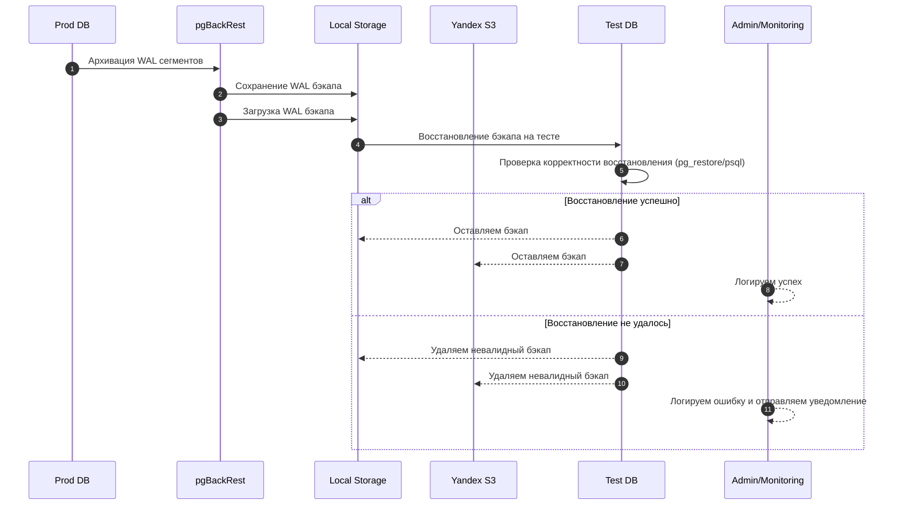
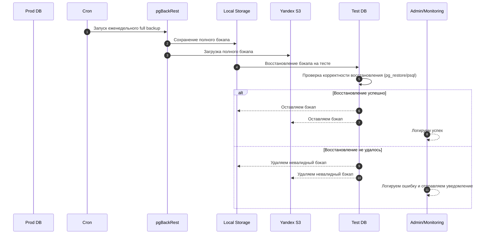
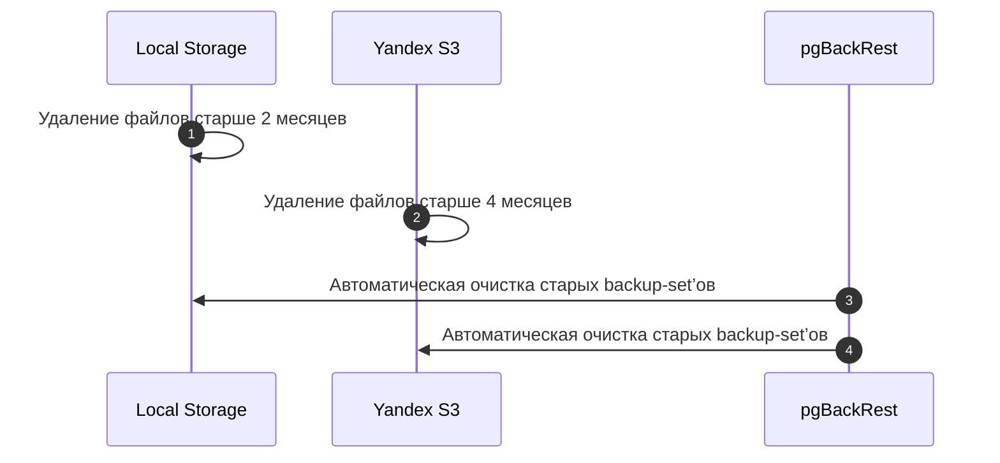

___
Теги: #task #knwoledge 
Дата создания: 2025-09-18 07:40 
Последнее изменение: четверг 18-го сентября 2025 07:40:08
<< [[2025-09-17]] | [[2025-09-19]] >> 
___
## Общий план резервного копирования PostgreSQL  с применением pgBackRest

### 1. Архитектура и компоненты

- **Продуктивная база (Prod DB)** – основной источник данных.
- **Тестовая база (Test DB)** – для проверки корректности бэкапов.
- **Внутренне хранилище бэкапов (Cephs)** – внутренний S3, для хранения локальных копий БД.
- **Yandex Object Storage** – облачное хранение бэкапов.
- **Мониторинг и алёрты** – Prometheus + Grafana + Telegram notifications.
- **pgBackRest** – инструмент для создания full, differential и incremental бэкапов, PITR.

---
### 2. Типы бэкапов

| Тип                   | Частота                   | Хранение                                                            |
| --------------------- | ------------------------- | ------------------------------------------------------------------- |
| WAL (инкрементальный) | Ежедневно                 | Локальный backup server + S3 (4 месяца в облаке, 2 месяца локально) |
| Full backup           | Еженедельно               | Локально + S3                                                       |
| Проверка бэкапа       | Еженедельно/по завершению | Тестовая база                                                       |

---
### 3. Общий Workflow создания бэкапа

1. **Ежедневный WAL backup**
    - pgBackRest автоматически архивирует *WAL* сегменты.
    - WAL сегменты выгружаются *локально* и в *Yandex Object Storage*.
    - Автоматически разворачиваем бэкап на *Test DB*.
    - Проверяем корректность восстановления (pg_restore или psql).
    - В случае ошибки: *логируем* + *уведомляем* админа и *удаляем* невалидный бэкап.
	    - ***(успешные будем делать каждый день?)***.
2. **Еженедельный full backup**
    - *Cron* запускает pgBackRest на *Prod DB*.
    - Full backup сохраняется *локально* и выгружается в *Yandex Object Storage*.
    - Автоматически разворачиваем бэкап на *Test DB*.
    - Проверяем корректность восстановления (pg_restore или psql).
    - В случае ошибки: *логируем* + *уведомляем* админа и *удаляем* невалидный бэкап.
3. **Retention & Cleanup**
    - Локально: удаляем файлы старше 2 месяцев.
    - S3: удаляем файлы старше 4 месяцев.
    - pgBackRest поддерживает автоматическое удаление старых backup-set’ов.

---

### 4. Описание Workflow в диаграммах последовательности

#### 4.1 Инкрементный бэкап

#### 4.2 Еженедельный full backup

#### 4.3 Retention & Cleanup

### 5. Мониторинг и алёрты

- **Prometheus + Grafana**
    - **Метрики**: завершение бэкапа, скорость, размер, ошибки.
    - **Дашборд**: статус ежедневного и еженедельного бэкапа.
- **Telegram Notifications**
    - Сообщение при успешном/неуспешном завершении бэкапа.
    - Сообщение при ошибке восстановления на тестовой базе.

---

### 6. Пример расписания РК (требуется финилизация)

|День|Действие|Система|
|---|---|---|
|Пн–Пт|Ежедневный WAL backup|pgBackRest|
|Сб|Full backup Prod DB|pgBackRest + S3|
|Вс|Тест восстановления Full backup на Test DB|pgBackRest + Test DB|
|Каждый день|Мониторинг и алёрты|Prometheus + Telegram|

---
### Zero-Links
- [[00 NTechLab]]
- [[00 DevOps]]

### Links
- [[Общее про задачи на испытательный]]
