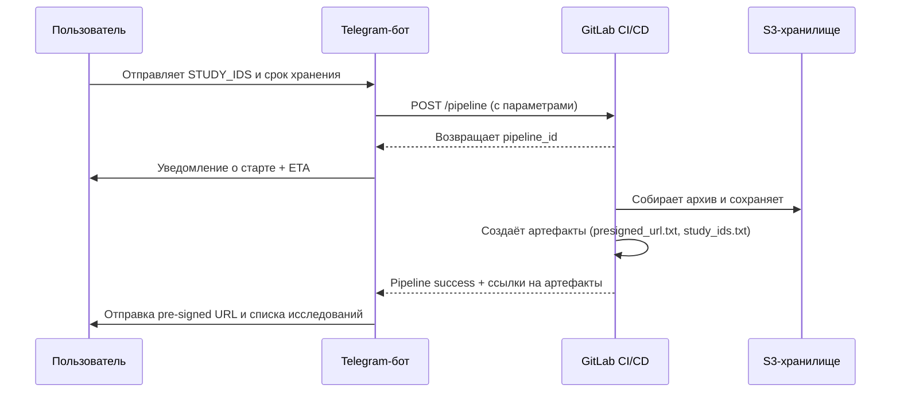

___
Теги: #task 
Дата создания: 2025-09-15 10:16 
Последнее изменение: Monday 15th September 2025 10:16:54
<< [[2025-09-14]] | [[2025-09-16]] >> 
___
## Основное

**Полигон** — Спроектировать и реализовать с нуля ключевой элемент инфраструктуры — **_"Полигон клинической оценки"_**. Это достаточно большой сервис, который напрямую будет связан с новым пайплайном по **_"Выгрузке исследований"._** Основная задача сервиса - быстро и легко дать людям из разных команд возможность загружать, выгружать и просматривать иследования с наших архивов. (требуется дополнительный синк для уточнения ТЗ).

Общий **workflow** всего процесса будет выглядеть следующим образом:
1. Пользователь отправляет боту в Telegram список исследований в виде текста, а также сроки хранения данных.
2. Бот при помощи **GitLab CI API** стартует пайплайн для выгрузки исследований (можно ли так сделать ?)
3. Бот уведомляет пользователя о том, что процесс начался (желательно ещё вывести примерное время ожидания из gitlab ci)
4. Как-только процесс заканчивается успехом - генерируется набор артефактов. Было бы хорошо вывести из артефактов данные (pre-signed URL ссылка на скачивание полученных исследований) и бот отправляет сообщение с ссылкой человеку запросившему исследование

## 1. Формализованный Workflow

### Workflow процесса выгрузки исследований через Telegram-бота

1. **Пользователь**
    
    - Отправляет боту список `STUDY_IDS` и срок хранения данных.
        
    - Общается только через Telegram, без необходимости заходить в GitLab.
        
2. **Telegram-бот**
    
    - Принимает данные от пользователя.
        
    - Формирует запрос к **GitLab CI API** для запуска пайплайна.
        
    - Передаёт в пайплайн параметры:
        
        - `STUDY_IDS`
            
        - `EXPIRE_DAYS`
            
        - (опционально) `OUTPUT_FLAG`, `ARCHIVE_NAME`
            
3. **GitLab CI/CD пайплайн**
    
    - Запускает процесс выгрузки исследований.
        
    - Собирает архив с данными.
        
    - Создаёт артефакты:
        
        - `presigned_url.txt` — ссылка для скачивания архива.
            
        - `study_ids.txt` — список обработанных исследований.
            
4. **Telegram-бот**
    
    - Отслеживает статус пайплайна через GitLab API.
        
    - Уведомляет пользователя:
        
        - о старте процесса;
            
        - об ориентировочном времени выполнения;
            
        - об успешном завершении.
            
    - По завершении отправляет пользователю **pre-signed URL** для скачивания архива.
        

---

## 2. Mermaid-диаграмма

5. [ ] Написать **бота**, реализующего **базовый UI функционал** и стартующий пайплайн по выгрузке исследований *(рабочий бот, отправка списка исследований, получение pre-signed URL на скачивание исследований*).
6. [ ] 

___
### Zero-Links
- 

### Links
- 
