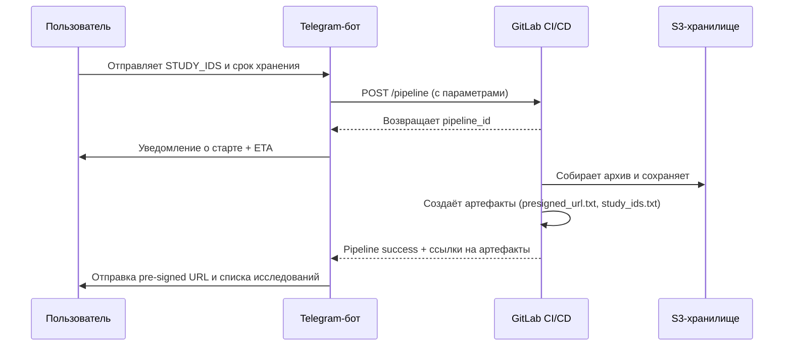

___
Теги: #task 
Дата создания: 2025-09-15 10:16 
Последнее изменение: Monday 15th September 2025 10:16:54
<< [[2025-09-14]] | [[2025-09-16]] >> 
___
## Основное

**Полигон** — Спроектировать и реализовать с нуля ключевой элемент инфраструктуры — **_"Полигон клинической оценки"_**. Это достаточно большой сервис, который напрямую будет связан с новым пайплайном по **_"Выгрузке исследований"._** Основная задача сервиса - быстро и легко дать людям из разных команд возможность загружать, выгружать и просматривать иследования с наших архивов. (требуется дополнительный синк для уточнения ТЗ).

### Основная этапность разработки выглядит следующим образом:

1. [ ] Разработка ТГ бота
2. [ ] Проектирование "Полигона"
3. [ ] Разработка и ввод в эксплуатацию
4. [ ] Демо-презентация

## Workflow процесса выгрузки исследований через Telegram-бота

1. **Пользователь**
    - Отправляет боту список `STUDY_IDS` и срок хранения данных.
    - Общается только через Telegram, без необходимости заходить в GitLab.
2. **Telegram-бот**
    - Принимает данные от пользователя.
    - Формирует запрос к **GitLab CI API** для запуска пайплайна.
    - Передаёт в пайплайн параметры:
        - `STUDY_IDS`
        - `EXPIRE_DAYS`
        - (опционально) `OUTPUT_FLAG`, `ARCHIVE_NAME`
3. **GitLab CI/CD пайплайн**
    - Запускает процесс выгрузки исследований.
    - Собирает архив с данными.
    - Создаёт артефакты
4. **Telegram-бот**
    - Отслеживает статус пайплайна через GitLab API.
    - Уведомляет пользователя:
        - *о старте процесса;*
        - *об ориентировочном времени выполнения;*
        - *об успешном завершении.*
    - По завершении отправляет пользователю **pre-signed URL** для скачивания архива.
---

### Mermaid-диаграмма

### Список задач (Roadmap)

### Этап 1. Подготовка инфраструктуры
- [ ]  Проверить доступ к **GitLab CI API** (получить токен, настроить права).
- [ ]  Добавить в пайплайн поддержку переменных `STUDY_IDS`, `EXPIRE_DAYS`, `ARCHIVE_NAME`.
- [ ]  Убедиться, что артефакты (`presigned_url.txt`, `study_ids.txt`) формируются корректно.
### Этап 2. Разработка Telegram-бота
- [ ]  Поднять минимальный бот на Python (**aiogram**).
- [ ]  Реализовать команду `/export` с вводом списка `STUDY_IDS` и параметров.
- [ ]  Интегрировать вызов **GitLab CI API** (POST /pipeline).
- [ ]  Обрабатывать `pipeline_id` и хранить его в сессии пользователя.
### Этап 3. Мониторинг пайплайна
- [ ]  Реализовать периодическую проверку статуса пайплайна через GitLab API.
- [ ]  Определять *ETA*.
- [ ]  Отправлять уведомления пользователю: старт, прогресс, успех, ошибки.
### Этап 4. Выдача результатов
- [ ]  После завершения пайплайна получить артефакты через GitLab API.
- [ ]  Прочитать `presigned_url.txt` и `study_ids.txt`.
- [ ]  Отправить пользователю *pre-signed ссылку* и список обработанных исследований.
### Этап 5. Дополнительно (будущее развитие)
- [ ]  Поддержка inline-кнопок в Telegram (скачать архив, перезапустить).
- [ ]  Логику очередей (если пользователь запускает несколько выгрузок подряд).
- [ ]  Авторизация/ограничение доступа (по ID сотрудников).
___
### Zero-Links
- 

### Links
- 
